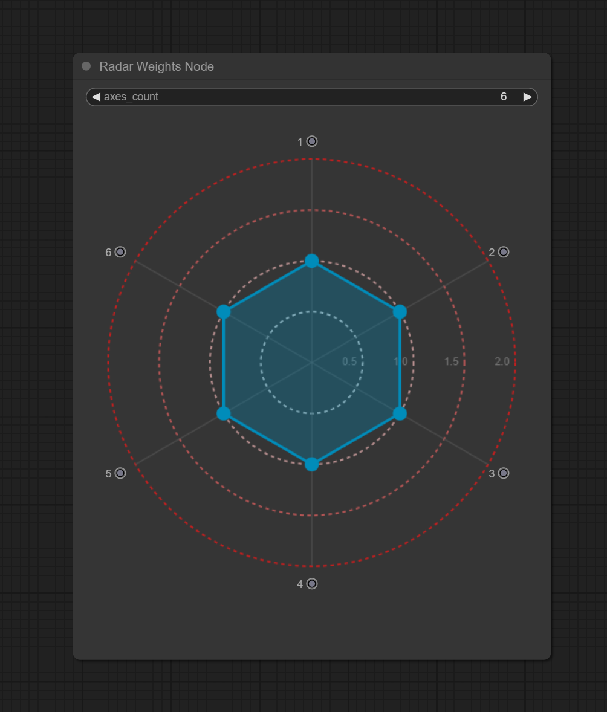

# ComfyUI Radar Weights Node

<p align="center">
  
</p>


A custom node for ComfyUI that provides an interactive radar chart widget to visually set and output multiple float weights simultaneously. Ideal for controlling parameters like LoRA weights, regional prompt emphasis, or any scenario requiring multiple related float values.

## Features

*   **Interactive Radar UI:** Adjust weights by dragging points on a radar chart.
*   **Configurable Axes:** Set the number of output weights (axes) from 3 to 10.
*   **Dynamic Outputs:** Provides individual float outputs for each axis.
*   **Visual Feedback:** Clearly see the current weight distribution on the chart.
*   **Reference Circles:** Configurable background circles (0.5, 1.0, 1.5, 2.0) provide visual guidance for weight values.
*   **Persistence:** Weight settings are saved within the workflow and automatically restored when the workflow is loaded. They also persist across ComfyUI restarts for the specific node instance.
*   **Standard ComfyUI Integration:** Works seamlessly within the ComfyUI graph.
*   **Spread out Ports:** output ports are spread out along the axis for easy identification.

## Installation

1.  **Clone the Repository:**
    Navigate to your ComfyUI `custom_nodes` directory:
    *   Example: `D:\ComfyUi\custom_nodes\`
    Open a terminal or command prompt in this directory and run:
    ```bash
    git clone https://github.com/FunnyFinger/ComfyUi-RadarWeightNode.git 
    ```

2.  **Restart ComfyUI:**
    Close any running instance of ComfyUI and restart it.

The node should now appear in the node menu under the `Spider/Widgets` category.


## Usage

1.  **Add the Node:** Right-click on the ComfyUI canvas, select "Add Node", navigate to "Spider/Widgets", and choose "Radar Weights Node".
2.  **Configure Axes:** Adjust the `axes_count` widget on the node to set the desired number of weights (between 3 and 10). The radar chart and output ports will update automatically.
3.  **Set Weights:**
    *   Click and drag the blue points on the radar chart outwards or inwards to set the weight for each axis.
    *   The weight value corresponds to the distance from the center, ranging from 0.0 (center) up to 2.0 (outermost reference circle).
4.  **Connect Outputs:** Connect the numbered output ports (1, 2, 3, ...) to other nodes requiring float inputs. The value from each output corresponds to the weight set for that axis on the radar chart.

## Node Details

### Inputs

*   **`axes_count` (Widget):**
    *   Type: `INT`
    *   Controls the number of axes (and corresponding output ports) on the radar chart.
    *   Range: 3 to 10
    *   Default: 5

### Outputs

*   **`1` - `10` (Dynamically generated):**
    *   Type: `FLOAT`
    *   Each output corresponds to an axis on the radar chart, starting from the top (12 o'clock) and proceeding clockwise.
    *   The value represents the weight set for that axis (0.0 to 2.0).
    *   The number of active outputs matches the `axes_count` setting.

### UI Explanation

*   **Radar Area:** The main circular area where weights are visualized.
*   **Axes Lines:** Gray lines radiating from the center, representing each output weight.
*   **Reference Circles:** Dotted circles indicating specific weight values (0.5, 1.0, 1.5, 2.0) with corresponding colors.
*   **Control Points:** Blue circles located on the axes lines. Drag these to change the weight for the corresponding axis. Points turn lighter blue when hovered or grabbed.
*   **Data Polygon:** The blue shaded area connecting the control points, giving a visual representation of the overall weight distribution.

## Visual Showcase

<p align="center">
  
</p>

**Basic Usage:**


**Connecting to LoRAs (Example):**

<p align="center">
  
</p>

## Sample Workflow

<p align="center">
  
</p>

Drag and drop the image in ComfyUi for the sample workflow

## Persistence Details

The node saves its current weights automatically.
*   **Workflow Saving:** When you save your ComfyUI workflow (API format or web UI save), the current `axes_count` and the weights string are stored within the node's data in the workflow JSON. Loading the workflow restores this state.
*   **Session Persistence:** The node also saves the weights for its specific instance ID to a local file (`storage/radar_weights_weights.json` within the custom node directory). This means if you restart ComfyUI without saving the workflow, the node *should* reload its last known weights when the graph is rebuilt.

## Contributing

Contributions are welcome! Please feel free to open an issue or submit a pull request.

## License

This project is licensed under the MIT License - see the [LICENSE](LICENSE) file for details.
